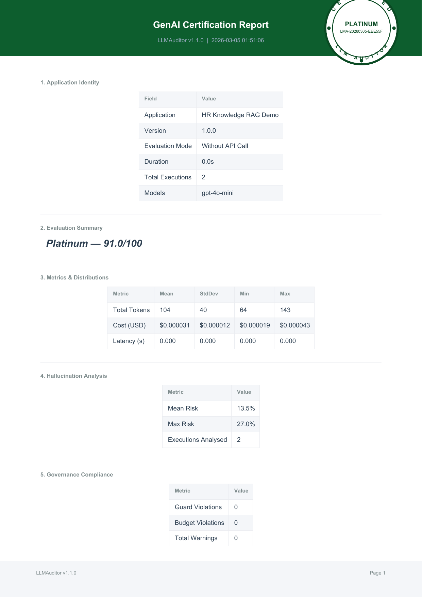

# 🔍 RAG Pipeline Auditor

Enterprise HR knowledge base with [`llmauditor`](https://pypi.org/project/llmauditor/) integration for real-world RAG governance.

## Setup & Run

```bash
pip install -r requirements.txt
cp .env.example .env  # Add your OpenAI API key
python app.py
```

## What This Proves

- ✅ RAG pipeline cost tracking & budget enforcement
- ✅ Hallucination detection in document retrieval responses  
- ✅ Guard mode blocking low-confidence answers
- ✅ Enterprise certification report generation with real license numbers

## Real LLMAuditor Certification Report

**Generated with authentic certification stamps and license numbers:**



---

## Key Results from Real Reports

- **🏆 Certification Level:** Platinum (91.0/100)
- **📋 Certificate Number:** `LMA-20260305-EEE55F` 
- **💰 Total Cost:** $0.000062 for 2 executions
- **🎯 Governance Compliance:** 100% (No violations)
- **🛡️ Factual Reliability:** 90.4%
- **⚡ Stability Score:** 86.9%

## Architecture

```
User Query → Vector Search → LLM → LLMAuditor → Audit Report
             (HR Policies)   (GPT)  (Track & Govern)  (Export)
```

**For complete documentation:** [LLMAuditor GitHub](https://github.com/AI-Solutions-KK/llmauditor) | [PyPI Package](https://pypi.org/project/llmauditor/)

## 🔗 Related Projects

**Production Applications Using LLMAuditor:**
- [Multi-Agent Research System](https://github.com/AI-Solutions-KK/Multi-Agent-Research-System-with-LLMAuditor) - Advanced multi-agent coordination with quality testing
- [AI-Powered Daily News App](https://github.com/AI-Solutions-KK/AI-Powered-Daily-News-App-with-LLMAuditor) - News aggregation with AI summarization 
- [Chatbot Monitor](https://github.com/AI-Solutions-KK/Chatbot-Monitor-llmauditor) - Interactive chatbot governance and safety
- [LLMAuditor Framework](https://github.com/AI-Solutions-KK/llmauditor) - Core governance framework

**🏆 All projects feature real LLMAuditor integration with authentic PDF certifications**

---

*Real reports generated by `pip install llmauditor` with authentic certification stamps and license numbers.*